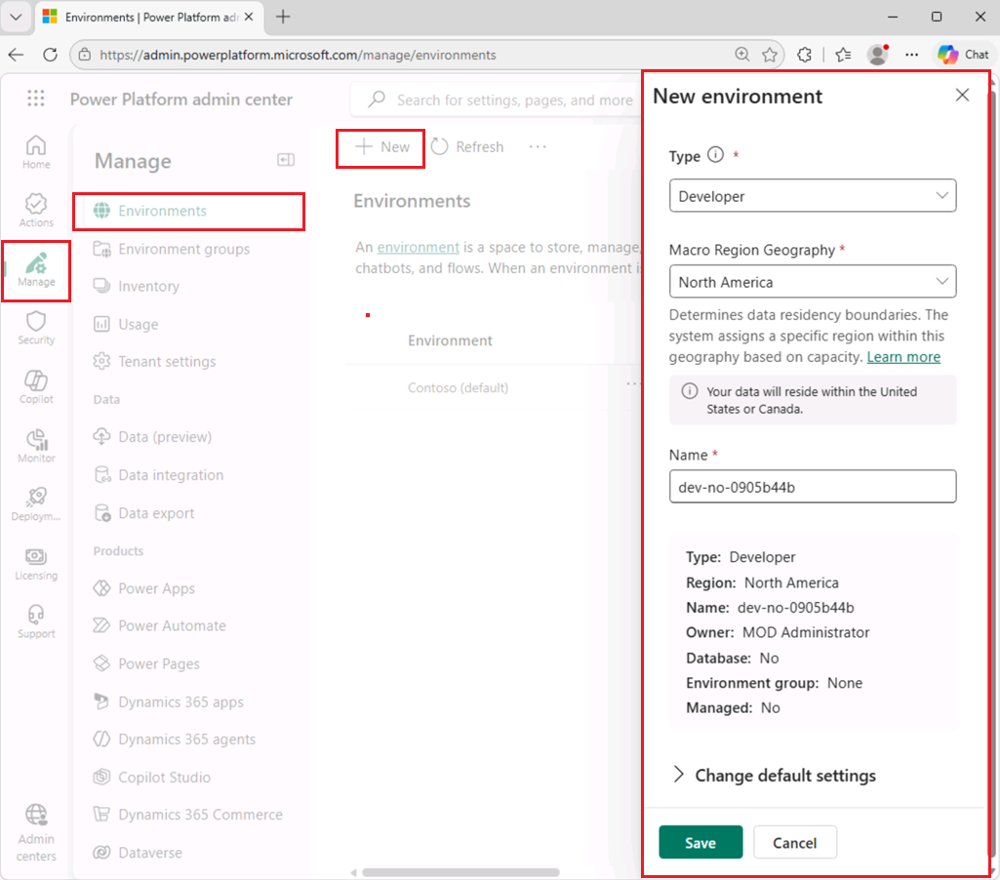
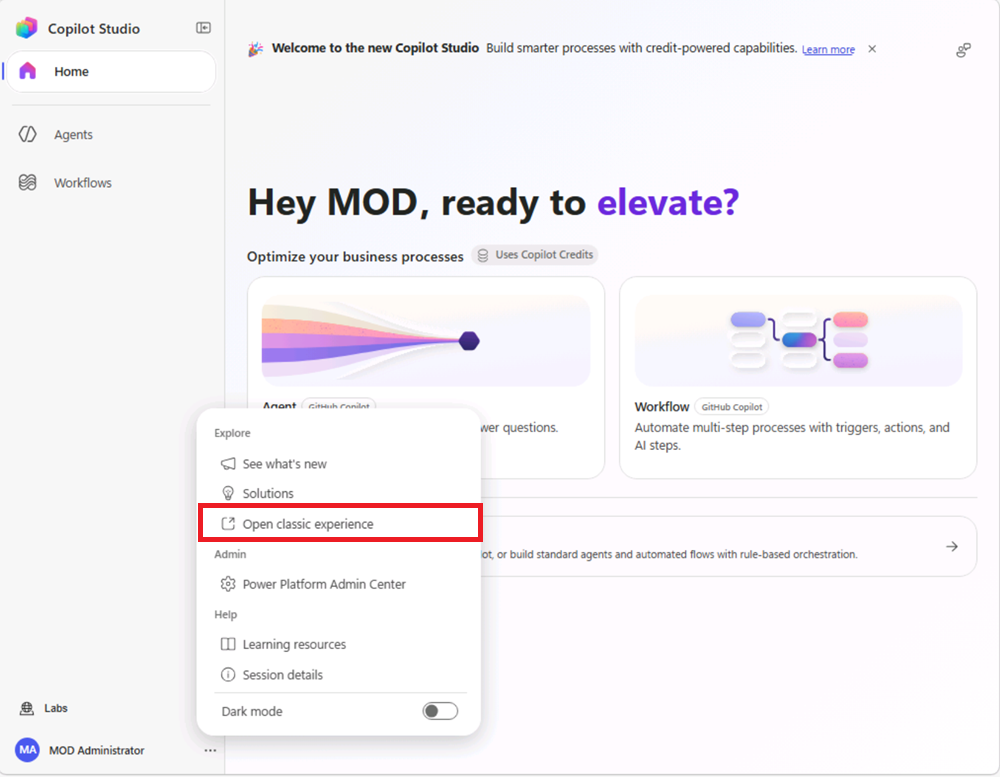
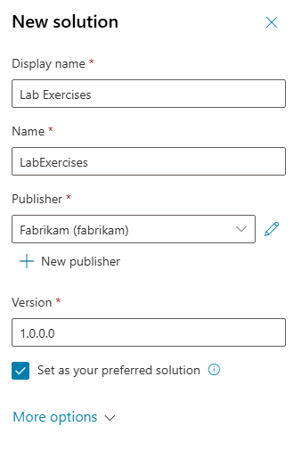

---
lab:
  title: ILT 설정
  module: 소개
  description: 이 연습에서는 Microsoft Copilot Studio 포털에 액세스하고, 나머지 랩에서 사용할 환경과 솔루션을 만듭니다.
  duration: 10 minutes
  level: 200
  islab: true
  primarytopics:
    - Microsoft Copilot
    - Microsoft Copilot Studio
---

## 연습 1 - Power Platform 환경 만들기

### 작업 1.1 - Power Platform 관리 센터

랩 연습을 시작하기 전에 작업에 사용할 개발 환경을 만들어야 합니다.

1. 웹 브라우저를 열고 `https://admin.powerplatform.microsoft.com/manage/environments`로 이동한 다음, 이 연습용 자격 증명으로 로그인합니다.

1. 로그인 상태를 유지할지 묻는 메시지가 표시되면 로그인 상태를 유지하는 옵션을 선택합니다.

1. 표시되는 모든 팝업 메시지를 닫습니다.

### 작업 1.2 - 기본 환경에 Dataverse 추가

1. **기본(default)** 환경(예: **Contoso(기본값)(Contoso (default))**)의 줄임표(**...**)를 선택한 다음 **Dataverse 추가(Add Dataverse)**를 선택합니다.

   

1. 모든 기본 설정을 그대로 두고 **추가(Add)**를 선택합니다.

### 작업 1.3 - 새 환경 만들기

1. **환경(Environments)** 페이지에서 **+ 새로 만들기(+ New)**를 선택하고 다음 설정으로 새 환경을 만듭니다.

   - **유형(Type)**: **`Developer`(개발자)**
   - **매크로 지역 지리(Macro Region Geography)**: **`North America`(북아메리카)**
   - **이름(Name)**: *사용자 이름*

   

1. **기본 설정 변경(Change default settings)**을 펼치고 다음과 같이 구성합니다.
   - **환경 그룹(Environment group)**: **`None`(없음)**
   - **관리형 환경으로 설정(Make this a Managed Environment)**: **`No`(아니요)**
   - **새 기능 미리 받기(Get new features early)**: **`No`(아니요)**
   - **대신 만들기(Create on behalf)**: **`No`(아니요)**
   - **Dataverse 데이터 저장소를 추가하시겠습니까?(Add a Dataverse data store?)**: **`Yes`(예)**
   
1. **다음(Next)**을 선택하고 **Dataverse 추가(Add Dataverse)** 섹션에서 다음과 같이 설정합니다.

   - **언어(Language)**: **`English (United States)`(영어(미국))**
   - **통화(Currency)**: **`USD ($)`(미국 달러)**
   - **샘플 앱 및 데이터를 배포하시겠습니까?(Deploy sample apps and data?)**: **`No`(아니요)**

1. **저장(Save)**을 선택하고 환경 상태가 **준비됨(Ready)**이 될 때까지 기다립니다. **새로 고침(Refresh)** 단추를 사용하여 표시 내용을 업데이트할 수 있습니다.

   > [!NOTE]
   > 테넌트 구성에 따라 환경 프로비저닝에 몇 분 정도 걸릴 수 있습니다.

   

1. 새 브라우저 탭에서 `https://copilotstudio.microsoft.com/`로 이동하고 메시지가 표시되면 로그인합니다.

   > [!NOTE]  
   > 사용자 환경에서 Copilot Studio를 로드하는 데 문제가 발생하는 경우 다음을 수행합니다.
   > - 먼저 Power Platform 관리 센터에서 환경 ID(GUID)를 확인합니다.
   >   1. `https://admin.powerplatform.microsoft.com/manage/environments`에서 만든 환경을 엽니다.
   >   2. URL에서 환경 ID(`12345678-90ab-cdef-1234-567890abcdef`와 같은 긴 문자열)를 찾습니다.
   >   3. 이 값을 복사하여 저장합니다.
   > - 그런 다음 다음 URL에 ID를 붙여 넣어 환경에 직접 액세스해 봅니다.
   >   ```
   >   https://copilotstudio.microsoft.com/environments/<your-environment-id>/home
   >   ```

1. 메시지가 표시되면 **시작하기(Get Started)**를 선택하고 기본 국가 또는 지역 설정을 유지합니다.

1. 모든 환영 메시지를 건너뜁니다.

1. 페이지 왼쪽 아래에서 사용자 이름 옆의 줄임표(**...**)를 선택한 다음 **클래식 환경 열기(Open classic experience)**를 선택합니다.

   

1. **이전 환경을 열기 전에 피드백을 공유하시겠습니까?(Share feedback before opening the previous experience?)** 대화 상자에서 **피드백 건너뛰기(Skip feedback)**를 선택합니다. 클래식 환경이 새 브라우저 탭에서 열립니다.

1. **Microsoft Copilot Studio 시작(Welcome to Microsoft Copilot Studio)** 대화 상자가 나타나면 **시작하기(Get Started)**를 선택하고 추가 환영 메시지를 모두 건너뜁니다.

1. 클래식 환경 페이지의 오른쪽 위에서 **환경 선택기(Environment Selector)**를 사용하여 환경을 전환하고, 앞에서 만든 환경을 선택합니다.

   

### 작업 1.4 - 솔루션 만들기

1. 왼쪽 탐색 창에서 줄임표 **(…)**를 선택한 다음 **솔루션(Solutions)**을 선택합니다.

1. **기본 솔루션(Default Solution)** 및 **Common Data Services 기본 솔루션(Common Data Services Default Solution)**을 포함한 여러 솔루션이 표시되는지 확인합니다.

   

1. **+ 새 솔루션(+ New solution)**을 선택합니다.

1. **표시 이름(Display name)** 텍스트 상자에 **`Lab Exercises`(랩 연습)**를 입력합니다.

1. **이름(Name)**이 자동으로 입력되었는지 확인합니다.

1. **게시자(Publisher)** 드롭다운 아래에서 **+ 새 게시자(+ New publisher)**를 선택합니다.

1. **표시 이름(Display name)**에 **`Fabrikam`(패브리캠)**을 입력합니다.

1. **이름(Name)**에 `fabrikam`을 입력합니다.

1. **접두사(Prefix)**에 `fab`을 입력합니다.

1. **저장(Save)**을 선택하여 게시자를 만듭니다.

1. **게시자(Publisher)** 드롭다운에서 **Fabrikam(fabrikam)**이 선택되었는지 확인합니다.

1. **기본 설정 솔루션으로 지정(Set as your preferred solution)** 확인란을 선택합니다.

   > [!NOTE]
   > 기본 설정 솔루션으로 지정하면 이후 랩에서 만드는 새 자산이 기본적으로 **`Lab Exercises`(랩 연습)** 솔루션에 추가됩니다.

   

1. **만들기(Create)**를 선택합니다.

1. **솔루션(Solutions)** 브라우저 탭을 닫습니다.

1. **Copilot Studio** 페이지를 새로 고칩니다.

이제 작업에 사용할 Power Platform 환경과 솔루션이 준비되었습니다.
