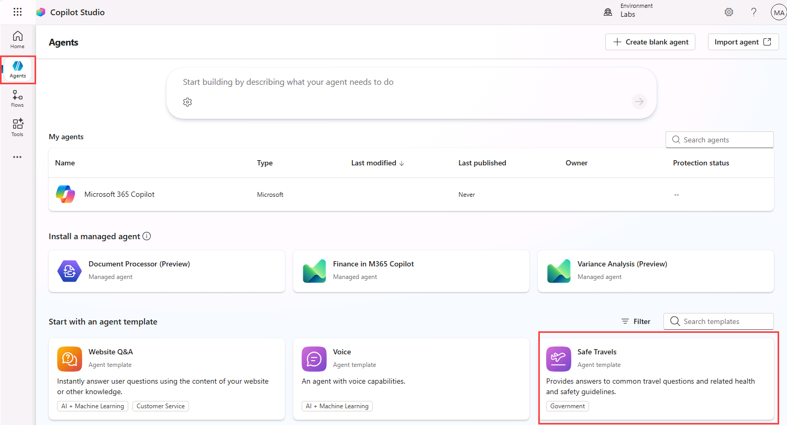
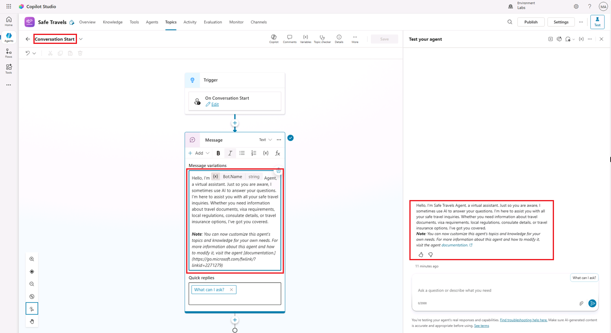
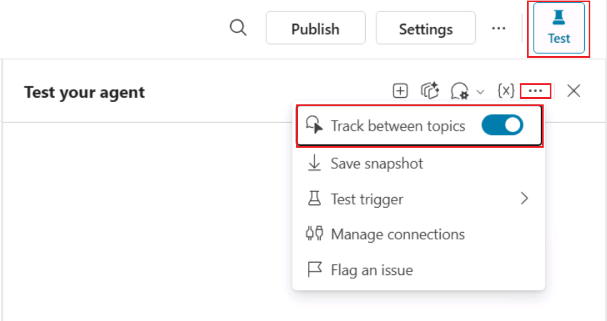
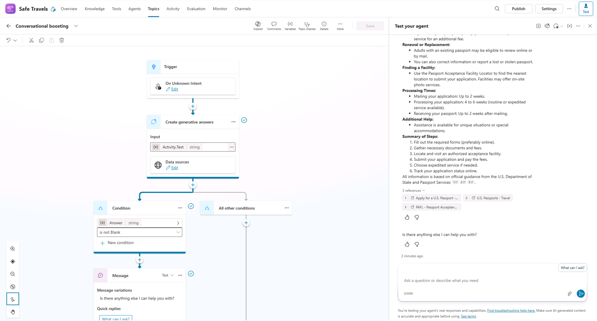
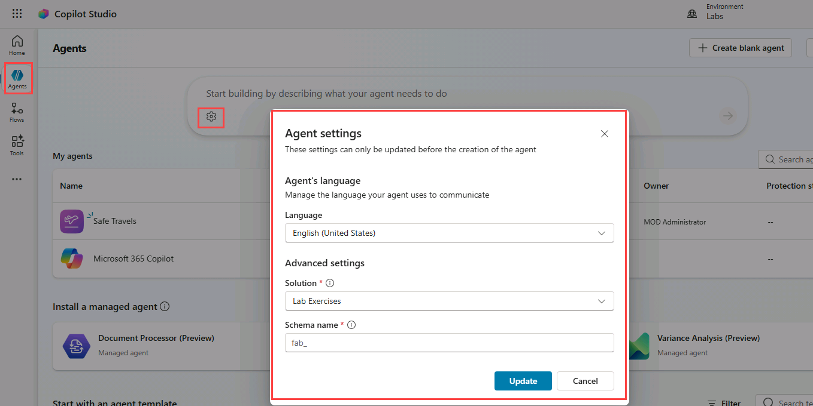
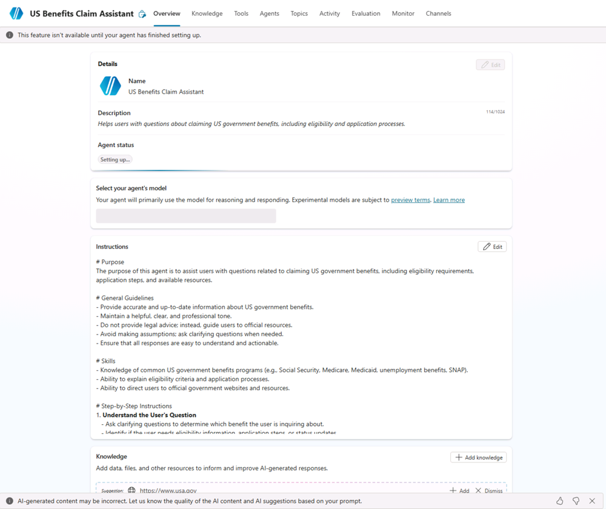
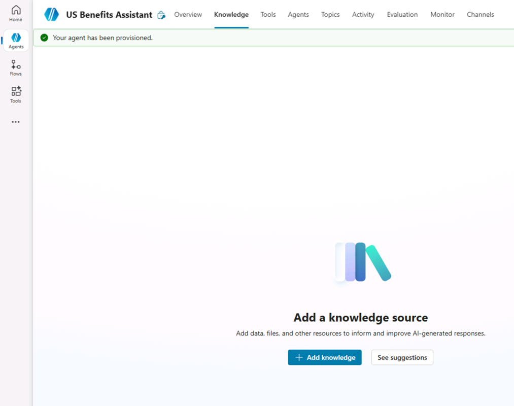
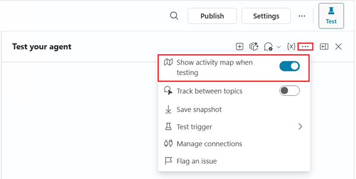
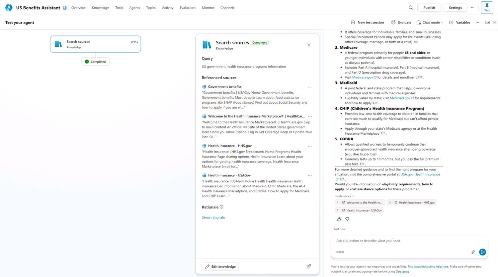
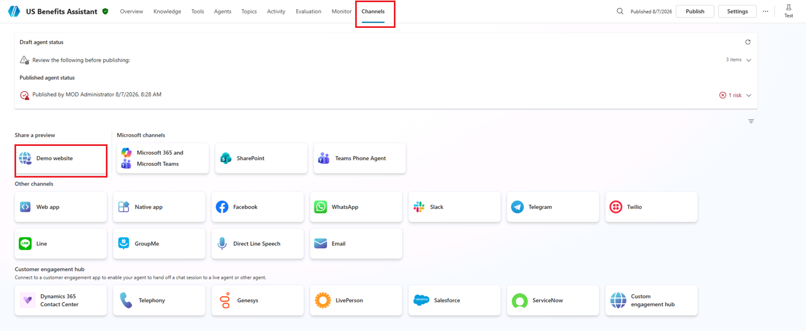

---
lab:
  title: Copilot Studio를 사용하여 에이전트 만들기
  module: Microsoft Copilot Studio에서 에이전트 만들기
  description: 이 연습에서는 Microsoft Copilot Studio 포털에 액세스하고, 적절한 환경을 선택한 다음, 새 에이전트를 만듭니다.
  duration: 45 minutes
  level: 200
  islab: true
  primarytopics:
    - Microsoft Copilot
    - Microsoft Copilot Studio
---

# Copilot Studio를 사용하여 에이전트 만들기

## 시나리오

이 연습에서는 다음 작업을 수행합니다.

- 템플릿에서 에이전트 만들기
- 에이전트를 만들고 이름 지정하기
- 지침을 사용하여 에이전트의 동작 방식 정의하기
- 공개 웹 사이트를 지식 원본으로 추가하기
- 에이전트를 게시하고 데모 웹 사이트에서 테스트하기

이 연습을 완료하는 데 약 **45**분이 걸립니다.

## 학습 내용

- 템플릿에서 에이전트를 만드는 방법
- 자연어를 사용하여 에이전트를 만드는 방법
- 에이전트 지침이 생성형 동작에 미치는 영향
- 생성형 AI 답변에서 구성된 지식 원본을 사용하는 방법
- 데모 웹 사이트에 에이전트를 게시하는 방법

## 랩 개요

- 템플릿에서 에이전트 만들기
- Copilot을 사용하여 에이전트 만들기
- 지침을 사용하여 에이전트 동작 정의하기
- 생성형 AI 지식 원본 추가하기
- 에이전트 게시하기

## 필수 조건

- Microsoft Entra ID 계정이 있어야 합니다.
- Copilot Studio 라이선스가 있거나 [무료 평가판](https://go.microsoft.com/fwlink/p/?linkid=2252605)에 등록해야 합니다.
- 에이전트와 관련 자산을 만들 수 있는 Power Platform 환경 및 솔루션에 액세스할 수 있어야 합니다.
- 다음 중 하나를 사용할 수 있습니다.
  - **ILT 설정(ILT Setup)** 랩에서 만든 환경 및 **`Lab Exercises`(랩 연습)** 솔루션
  - 사용자가 보유한 기존 환경 및 솔루션
- 환경과 솔루션이 아직 준비되지 않았다면 계속하기 전에 **ILT 설정(ILT Setup)** 랩의 단계를 완료합니다.

> [!IMPORTANT]
> 현재 미리 보기로 제공되는 새로운 Copilot Studio 환경이 표시될 수 있습니다. 이 랩에서는 현재 Copilot Studio 인터페이스를 사용하므로 일부 단계와 스크린샷이 미리 보기 환경과 일치하지 않을 수 있습니다. 랩 지침을 원활하게 수행하려면 연습 전반에서 클래식 Copilot Studio UI 환경을 사용합니다.

## 핵심 개념: 에이전트 구성 요소 및 동작

생성형 오케스트레이션을 사용하도록 설정하면 에이전트가 지침, 지식, 토픽 및 도구를 사용하여 동적으로 응답을 생성할 수 있습니다.

## 연습 1 - 템플릿에서 에이전트 만들기

이 연습에서는 템플릿을 사용하여 에이전트를 만든 다음 테스트합니다.

### 작업 1.1 – Safe Travels 템플릿에서 에이전트 만들기

1. **Copilot Studio** 홈페이지 `https://copilotstudio.microsoft.com/`로 이동합니다.

1. **Copilot Studio** 클래식 환경에 있는지 확인합니다. 클래식 환경이 아니면 계속하기 전에 클래식 환경으로 전환합니다.

1. 페이지 위쪽에서 이 연습에 사용할 환경에서 작업 중인지 확인합니다.

1. 왼쪽 탐색 메뉴에서 **에이전트(Agents)**를 선택합니다.

1. 페이지 위쪽에서 이 연습에 사용할 환경에서 작업 중인지 확인합니다.

1. **에이전트 템플릿으로 시작(Start with an agent template)** 섹션에서 **Safe Travels(안전한 이동)** 템플릿을 선택합니다.

   

1. 페이지 오른쪽 위에서 줄임표(**...**)를 선택한 다음 **고급 설정 편집(Edit advanced settings)**을 선택합니다.

1. 선택한 **솔루션(Solution)**이 **`Lab Exercises`(랩 연습)**이고 **스키마 이름(Schema name)** 접두사가 `fab`인지 확인한 다음 **취소(Cancel)**를 선택합니다.

1. 페이지 오른쪽 위에서 **만들기(Create)**를 선택합니다.

1. **개요(Overview)** 탭에서 이름, 설명 및 에이전트 지침을 검토합니다.

1. **지식(Knowledge)** 탭을 선택하고 지식 원본으로 추가된 공개 웹 사이트를 검토합니다.

1. 페이지 오른쪽 위에서 **설정(Settings)** 단추를 선택합니다.

1. **오케스트레이션(Orchestration)**이 **`No - Use classic orchestration, limiting responses to the content and behavior defined in your agent's topics`(아니요 - 클래식 오케스트레이션을 사용하여 에이전트 토픽에 정의된 콘텐츠와 동작으로 응답을 제한합니다)**로 설정되어 있는지 확인합니다.

1. **설정(Settings)** 페이지의 오른쪽 위에서 **X**를 선택하여 설정을 닫습니다.

1. **토픽(Topics)** 탭을 선택한 다음 **시스템(System)** 필터를 선택합니다.

1. **Conversation Start** 토픽을 선택합니다. **메시지(Message)** 노드의 내용을 검토합니다. 메시지 내용이 **테스트(Test)** 창에 표시되는지 확인합니다.

   

1. 페이지 왼쪽 위에서 Conversation Start가 표시된 드롭다운을 열고 사용자 지정 **What can I ask** 토픽을 선택합니다.

### 작업 1.2 – 에이전트 테스트

1. **테스트(Test)** 창이 보이지 않으면 페이지 오른쪽 위의 **테스트(Test)** 아이콘을 선택합니다.

1. **테스트(Test)** 창에서 변수 **{x}** 아이콘 옆의 줄임표(**...**)를 선택하고 **토픽 간 추적(Track between topics)**을 **켜기(On)**로 전환합니다.

   

1. 다음 영문 또는 한국어 프롬프트 중 하나를 입력합니다.

   ```prompt
   Hello
   ```

   ```prompt
   안녕하세요
   ```

   **Greeting** 토픽이 선택되고 Greeting 토픽의 메시지 노드에서 응답을 제공해야 합니다.

1. **테스트(Test)** 창 위쪽에서 **새 테스트 세션 시작(Start new test session)** 아이콘 **+**를 선택합니다.

1. 다음 영문 또는 한국어 프롬프트 중 하나를 입력합니다.

   ```prompt
   What can I ask?
   ```

   ```prompt
   무엇을 물어볼 수 있나요?
   ```

   **What Can I Ask** 토픽이 트리거되고 대화를 계속할 수 있는 여러 프롬프트 옵션이 표시되어야 합니다.

1. **How do I get a passport?** 옵션을 선택합니다.

   구성된 지식 원본을 사용하여 응답이 생성되어야 하며, Conversational boosting 시스템 토픽을 참조할 수 있습니다.

   

1. 다음 영문 또는 한국어 프롬프트 중 하나를 입력합니다.

   ```prompt
   What is Copilot Studio?
   ```

   ```prompt
   Copilot Studio란 무엇인가요?
   ```

   **Fallback** 토픽이 선택되고 에이전트가 질문을 바꾸어 표현해 달라고 요청해야 합니다.

1. 동일한 프롬프트를 두 번 더 반복합니다.
  환경 및 오케스트레이션 동작에 따라 에이전트가 Fallback 또는 Escalate 시스템 토픽을 트리거할 수 있습니다.

1. 왼쪽 탐색 메뉴에서 **에이전트(Agents)**를 선택합니다. **Safe Travels** 에이전트가 목록에 표시되어야 합니다.

## 연습 2 - Copilot을 사용하여 에이전트 만들기

이 연습에서는 자연어를 사용하여 정부 복지 혜택에 관한 질문에 답하는 새 에이전트를 만듭니다.

### 작업 2.1 – 정부 복지 혜택 질문에 답하는 에이전트 만들기

1. **Copilot Studio** 클래식 환경 홈페이지 `https://copilotstudio.microsoft.com/`에서 앞서 만든 환경에 있는지 확인합니다.

1. 왼쪽 탐색 메뉴에서 **에이전트(Agents)**를 선택합니다.

1. *에이전트가 수행해야 하는 작업을 설명하여 빌드 시작(Start building by describing what your agent needs to do)* 텍스트 상자의 왼쪽 아래에서 **톱니바퀴(Cog)** 이미지로 표시된 **에이전트 설정(Agent Settings)** 아이콘을 선택합니다.

   

1. 에이전트의 기본 언어를 **영어(미국)(English (United States))**로 유지합니다.

1. **솔루션(Solution)** 드롭다운에서 **`Lab Exercises`(랩 연습)**를 선택합니다.

1. **스키마 이름(Schema name)**에 `govbenefitsagent`를 입력합니다.

1. **업데이트(Update)**를 선택합니다.

1. *에이전트가 수행해야 하는 작업을 설명하여 빌드 시작(Start building by describing what your agent needs to do)* 텍스트 상자에 다음 영문 또는 한국어 프롬프트 중 하나를 입력합니다.

   ```prompt
   You are an agent that assists with questions related to claiming US government benefits.
   ```

   ```prompt
   미국 정부 복지 혜택 신청과 관련된 질문을 지원하는 에이전트입니다.
   ```

1. **보내기(Send)** 아이콘을 선택합니다.

   에이전트가 생성됩니다.

   

   에이전트 프로비저닝이 완료되면 에이전트 구성을 계속할 수 있습니다.

### 작업 2.2 – 개요 탭 구성

1. 에이전트의 **개요(Overview)** 탭을 선택합니다.

1. **세부 정보(Details)** 섹션에서 **편집(Edit)**을 선택합니다.

1. **이름(Name)** 텍스트 상자에 **`US Benefits Assistant`(미국 복지 혜택 지원 담당자)**를 입력합니다.

1. **설명(Description)** 텍스트 상자에 **`Helps users with questions related to US government benefit programs`(미국 정부 복지 혜택 프로그램과 관련된 사용자 질문을 지원함)**을 입력합니다.

1. **저장(Save)**을 선택합니다.

1. **에이전트 모델 선택(Select your agent's model)** 섹션에서 사용할 수 있는 경우 **GPT-5 Auto (Preview)**를 선택합니다. 그렇지 않으면 기본 모델을 선택된 상태로 둡니다.

1. **지침(Instructions)** 섹션에서 **편집(Edit)**을 선택합니다.

1. 에이전트 지침의 *# General Guidelines* 아래에 다음 영문 또는 한국어 프롬프트 중 하나를 추가합니다.

   ```prompt
   - Do not provide legal advice.
   ```

   ```prompt
   - 법률 자문을 제공하지 마세요.
   ```

1. **저장(Save)**을 선택합니다.

   > [!NOTE]
   > 에이전트 지침은 에이전트의 동작 방식을 안내하지만 동작을 엄격하게 적용하지는 않습니다. 이후 랩에서는 제한된 지식 원본을 사용하는 토픽, 지식 및 생성형 답변을 통해 동작을 변경하는 방법을 알아봅니다.

1. **추천 프롬프트(Suggested prompts)** 섹션에서 **+ 추천 프롬프트 추가(+ Add suggested prompts)**를 선택합니다.

1. **제목(Title)**에 **`Health`(건강)**를 입력합니다.

1. **프롬프트(Prompt)**에 **`What health assistance programs are available for me?`(어떤 건강 지원 프로그램을 이용할 수 있나요?)**를 입력합니다.

1. **저장(Save)**을 선택합니다.

### 작업 2.3 – 공개 웹 사이트를 지식 원본으로 추가

1. **지식(Knowledge)** 탭을 선택합니다.

   

1. **+ 지식 추가(+ Add knowledge)**를 선택합니다.

1. **공개 웹 사이트(Public websites)**를 선택합니다.

1. **공개 웹 사이트 링크(Public website link)** 텍스트 상자에 **`https://www.usa.gov/benefits`**를 입력합니다. 이 공식 정부 공개 웹 사이트에는 에이전트에 유용할 수 있는 복지 혜택 프로그램의 세부 정보가 있습니다.

1. **추가(Add)**를 선택합니다.

1. **이름(Name)**에 **`Government benefits`(정부 복지 혜택)**를 입력합니다.

1. **설명(Description)**에 **`This knowledge source contains information on government programs that may help you pay for food, housing, health care, and other basic living expenses.`(이 지식 원본에는 식비, 주거비, 의료비 및 기타 기본 생활비를 부담하는 데 도움이 될 수 있는 정부 프로그램에 관한 정보가 포함되어 있습니다.)**를 입력합니다.

1. **에이전트에 추가(Add to agent)**를 선택합니다.

   > [!NOTE]
   > 공개 웹 사이트 인덱싱에는 몇 분 정도 걸릴 수 있습니다. 응답이 완전하지 않으면 몇 분 기다린 후 에이전트를 다시 테스트합니다.

### 작업 2.4 – 에이전트 설정

1. 페이지 오른쪽 위에서 **설정(Settings)** 단추를 선택합니다.

1. **오케스트레이션(Orchestration)**이 **`Yes - Responses will be dynamic, using available tools and knowledge as appropriate`(예 - 사용 가능한 도구와 지식을 적절히 사용하여 동적으로 응답합니다)**로 설정되어 있는지 확인합니다.

1. **응답(Responses)** 섹션에 다음 영문 또는 한국어 프롬프트 중 하나를 입력합니다.

   ```prompt
   - For process related answer respond with a single sentence.
   - For data-related answers respond with bullet points.
   ```

   ```prompt
   - 프로세스 관련 답변은 한 문장으로 응답하세요.
   - 데이터 관련 답변은 글머리 기호 목록으로 응답하세요.
   ```

1. **지식(Knowledge)** 섹션에서 **근거 없는 응답 허용(Allow ungrounded responses)**을 **끄기(Off)**로 설정합니다.

1. **지식(Knowledge)** 섹션에서 **웹의 정보 사용(Use information from the Web)**을 **켜기(On)**로 설정합니다.

1. **저장(Save)**을 선택합니다.

1. **설정(Settings)** 페이지 왼쪽에서 **보안(Security)**을 선택합니다.

1. **인증(Authentication)**을 선택합니다.

1. 이 랩 시나리오에서는 데모 웹 사이트 채널의 테스트를 간소화하기 위해 **인증 없음(No authentication)**을 선택합니다.

1. **저장(Save)**을 선택한 다음 **저장(Save)**을 다시 선택합니다.

1. **설정(Settings)** 페이지의 오른쪽 위에서 **X**를 선택하여 설정을 닫습니다.

### 작업 2.5 – 에이전트 테스트

1. **테스트(Test)** 창이 보이지 않으면 페이지 오른쪽 위의 **테스트(Test)** 아이콘을 선택합니다.

1. **테스트(Test)** 창에서 변수 **{x}** 아이콘 옆의 줄임표(**...**)를 선택하고 **테스트 시 활동 맵 표시(Show activity map when testing)**를 **켜기(On)**로, **토픽 간 추적(Track between topics)**을 **끄기(Off)**로 전환합니다.

   

1. **테스트(Test)** 창 위쪽에서 **새 테스트 세션 시작(Start new test session)** 아이콘 **+**를 선택합니다.

1. 다음 영문 또는 한국어 프롬프트 중 하나를 입력합니다.

   ```prompt
   What health insurance information is available?
   ```

   ```prompt
   어떤 건강 보험 정보를 확인할 수 있나요?
   ```

   **활동 맵(Activity map)**이 표시되고 지식 원본을 사용하여 응답을 생성했음을 보여 주어야 합니다.

   

1. **테스트(Test)** 창을 닫습니다.

### 작업 2.6 – 데모 웹 사이트에 에이전트 게시

1. 에이전트의 작업 표시줄에서 **게시(Publish)** 단추를 선택한 다음 **게시(Publish)**를 다시 선택합니다.

1. **채널(Channels)** 탭을 선택합니다.

   

1. **데모 웹 사이트(Demo website)** 채널을 선택합니다. 이 채널은 에이전트 환경을 빠르게 테스트하고 미리 보는 데 유용합니다.

1. **데모 웹 사이트(Demo Website)** 창에서 다음 설정을 입력합니다.

   - **환영 메시지(Welcome message)**: **`Ask me about government benefit programs`(정부 복지 혜택 프로그램에 관해 질문해 주세요)**
   - **대화 시작 문구(Conversation starters)**에는 다음 영문 또는 한국어 프롬프트 중 하나를 입력합니다.

      ```prompt
      "Hello"
      "What programs am I entitled to?"
      "What is social security?"
      ```

      ```prompt
      "안녕하세요"
      "어떤 프로그램의 혜택을 받을 수 있나요?"
      "사회 보장이란 무엇인가요?"
      ```

1. **저장(Save)**을 선택합니다.

1. **데모 웹 사이트 열기(Open demo website)**를 선택합니다.

1. 다음 영문 또는 한국어 프롬프트 중 하나를 입력합니다.

   ```prompt
   What welfare and assistance can I claim for?
   ```

   ```prompt
   어떤 복지 혜택과 지원을 신청할 수 있나요?
   ```

   응답은 구성된 지식 원본의 정보를 참조해야 하며 인용 또는 원본 참조를 포함할 수 있습니다.

1. 몇 가지 질문을 더 입력하고 에이전트의 응답을 확인합니다. 기능은 제한적이지만 복지 혜택 관련 질문에 적절한 답변을 제공할 수 있어야 합니다.

## 요약

이 랩에서는 에이전트를 만들고 지침을 사용하여 예상 동작을 정의했습니다. 또한 공개 웹 사이트를 지식 원본으로 추가하고, 지식 원본을 통해 답할 수 있는 질문으로 에이전트를 테스트했습니다. 이후 랩에서는 토픽, 지식 및 도구를 사용하여 에이전트 동작을 더욱 세부적으로 제어하는 방법을 알아봅니다.
