---
lab:
  title: 워크플로를 도구로 사용
  module: 워크플로를 통합하여 에이전트 동작 향상
  description: 이 랩에서는 Copilot을 사용하여 에이전트를 만들고, 워크플로를 만든 다음, 워크플로를 에이전트와 토픽에 도구로 추가합니다.
  duration: 60 minutes
  level: 200
  islab: true
  primarytopics:
    - Microsoft Copilot Studio
---

# 워크플로를 도구로 사용

## 시나리오

이 연습에서는 다음 작업을 수행합니다.

- 에이전트 만들기
- 워크플로 만들기
- 워크플로를 도구로 추가
- 에이전트 및 토픽에서 도구 사용
- 에이전트 테스트

이 연습을 완료하는 데 약 **60**분이 소요됩니다.

## 학습할 내용

- 워크플로를 통해 에이전트가 결정적 작업을 수행하도록 하는 방법
- 워크플로를 도구로 구성하는 방법
- 토픽에서 워크플로를 사용하는 방법

## 랩의 주요 단계

- Copilot을 사용하여 에이전트 만들기
- Microsoft Teams에 메시지를 보내는 워크플로 만들기
- 워크플로를 에이전트에 도구로 추가
- 워크플로를 만들고 토픽에 추가

## 필수 구성 요소

- Microsoft Entra ID 계정이 있어야 합니다.
- Copilot Studio 라이선스가 있거나 [무료 평가판](https://go.microsoft.com/fwlink/p/?linkid=2252605)에 가입해야 합니다.
- 에이전트와 관련 자산을 만들 수 있는 Power Platform 환경 및 솔루션에 액세스할 수 있어야 합니다.
- Microsoft Teams에 액세스할 수 있고 Teams 채널에 메시지를 게시할 권한이 있어야 합니다.
- 다음 중 하나를 사용할 수 있습니다.
  - **ILT Setup** 랩에서 만든 환경 및 **`Lab Exercises`(랩 연습)** 솔루션
  - 사용 중인 기존 환경 및 솔루션
- 환경과 솔루션이 아직 준비되지 않았다면 계속하기 전에 **ILT Setup** 랩의 단계를 완료합니다.

> [!IMPORTANT]
> 현재 미리 보기로 제공되는 새로운 Copilot Studio 환경이 표시될 수 있습니다. 이 랩에서는 현재 Copilot Studio 인터페이스를 사용하므로 일부 단계와 스크린샷이 미리 보기 환경과 일치하지 않을 수 있습니다. 랩 지침을 올바르게 수행하려면 연습 전반에서 클래식 Copilot Studio UI 환경을 사용합니다.

## 핵심 개념: 에이전트 구성 요소 및 동작

생성형 오케스트레이션을 사용하도록 설정하면 에이전트가 지침, 지식, 토픽 및 도구를 사용하여 응답을 동적으로 생성할 수 있습니다. 에이전트는 도구를 사용하여 외부 시스템에서 작업을 수행하고, 데이터를 검색하며, 메시지를 보낼 수 있습니다. 일반적으로 도구는 작업을 수행하거나 외부 데이터를 검색하는 데 사용하고, 토픽은 구조화된 대화 흐름을 안내하는 데 사용합니다.

## 연습 1 - 에이전트 만들기

이 연습에서는 자연어를 사용하여 작업을 분석하고 분류하며 우선순위를 지정하는 새 에이전트를 만듭니다.

### 작업 1.1 – 작업 분석 에이전트 만들기

1. `https://copilotstudio.microsoft.com/`의 **Copilot Studio** 홈 페이지로 이동합니다.

1. **Copilot Studio** 클래식 환경을 사용 중인지 확인합니다. 그렇지 않다면 계속하기 전에 클래식 환경으로 전환합니다.

1. 페이지 위쪽에서 이 연습에 사용할 환경에서 작업 중인지 확인합니다.

1. 왼쪽 탐색 영역에서 **에이전트(Agents)**를 선택합니다.

1. *에이전트가 수행해야 할 작업을 설명하여 빌드 시작(Start building by describing what your agent needs to do)* 텍스트 상자의 왼쪽 아래에서 **톱니바퀴(Cog)** 이미지로 표시되는 **에이전트 설정(Agent Settings)** 아이콘을 선택합니다.

   

1. 에이전트의 기본 언어를 **영어(미국)(English (United States))**로 유지합니다.

1. **솔루션(Solution)** 드롭다운에서 **`Lab Exercises`(랩 연습)** 또는 이 연습에 사용할 다른 솔루션을 선택합니다.

1. *스키마 이름(Schema name)*에 `analyzetaskagent`를 입력합니다.

1. **업데이트(Update)**를 선택합니다.

1. *에이전트가 수행해야 할 작업을 설명하여 빌드 시작(Start building by describing what your agent needs to do)* 텍스트 상자에 다음 프롬프트를 입력합니다.

   ```prompt
   You are an agent that analyzes, categorizes, and prioritizes tasks.
   ```

   ```prompt
   작업을 분석하고 분류하며 우선순위를 지정하는 에이전트입니다.
   ```

1. **보내기(Send)** 아이콘을 선택합니다.

   에이전트 프로비저닝이 완료되면 에이전트 구성을 계속할 수 있습니다.

## 연습 2 - 워크플로 도구 만들기

이 연습에서는 Microsoft Teams에 메시지를 보내는 워크플로를 만듭니다. 이 워크플로를 에이전트에 추가합니다.
> [!NOTE]
> 테넌트 구성과 모델 동작에 따라 에이전트 응답, 오케스트레이션 동작 및 도구 사용 방식이 이 랩의 스크린샷과 약간 다를 수 있습니다.

### 작업 2.1 – Teams에 메시지 보내기 워크플로 만들기

1. Copilot Studio의 왼쪽 탐색 영역에서 **도구(Tools)**를 선택합니다.

   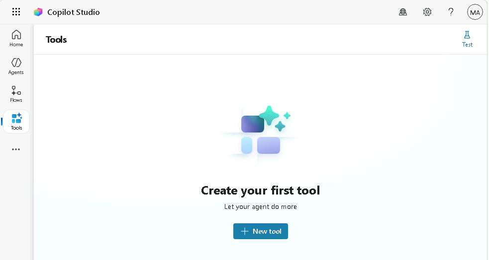

1. **+ 도구 추가(+ Add a tool)** 또는 **+ 새 도구(+ New tool)**를 선택합니다.

1. **도구 추가(Add Tool)** 대화 상자에서 **에이전트 흐름(Agent flow)** 타일을 선택합니다.

1. **에이전트가 흐름을 호출할 때(When an agent calls the flow)** 트리거와 **에이전트에 응답(Respond to the agent)** 작업이 워크플로에 추가되었는지 확인합니다.

   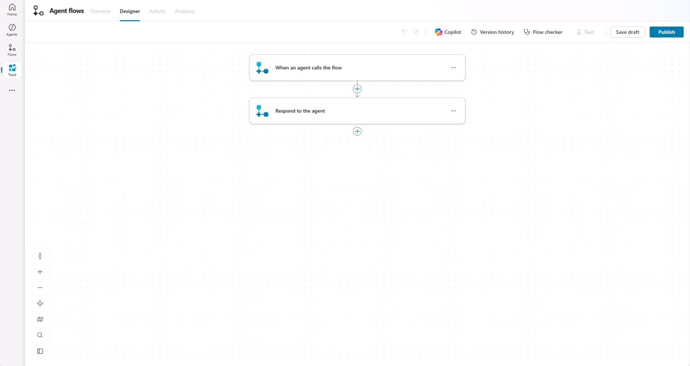

1. **에이전트가 흐름을 호출할 때(When an agent calls the flow)** 트리거 단계를 선택한 후 **+ 입력 추가(+ Add an input)**를 선택합니다.

1. **텍스트(Text)**를 선택합니다.

1. *입력(Input)*에 **`Task Summary`(작업 요약)**를 입력하고, *입력을 입력하세요(Please enter your input)*에 **`Analyzed tasks`(분석된 작업)**를 입력합니다.

   

1. 페이지 오른쪽 위 근처에서 **초안 저장(Save draft)**을 선택합니다.

1. **개요(Overview)** 탭을 선택합니다.

1. **세부 정보(Details)** 섹션에서 **편집(Edit)**을 선택합니다.

   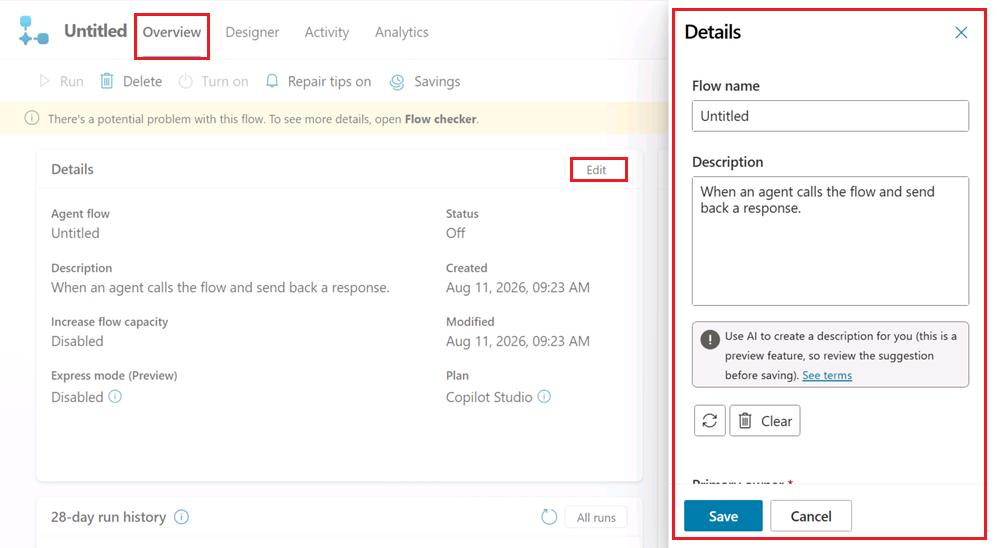

1. **세부 정보(Details)** 창에서 **흐름 이름(Flow name)**을 **`Send Summary to Teams`(Teams에 요약 보내기)**로 업데이트합니다.

1. **설명(Description)**에 **`Post a message to Teams with the summary of the task analysis`(작업 분석 요약을 Teams에 메시지로 게시)**를 입력합니다.

1. **저장(Save)**을 선택합니다.

### 작업 2.2 - Teams에 게시 작업

1. **디자이너(Designer)** 탭을 선택합니다.

1. 워크플로의 두 단계 사이에서 **+** 아이콘을 선택하여 새 작업을 삽입합니다.

1. **검색(Search)** 필드에 `Teams`를 입력하고 **Microsoft Teams** 커넥터에서 **자세히 보기(See more)**를 선택합니다.

   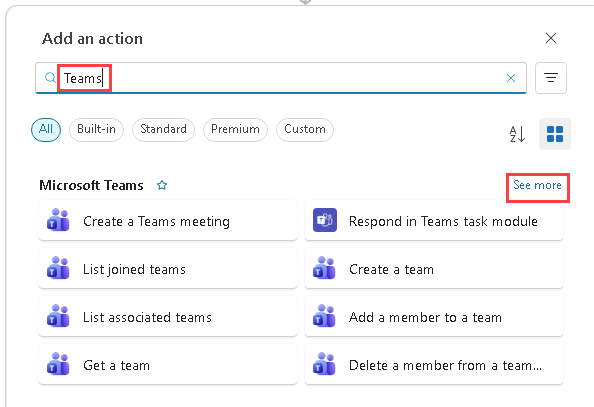

1. **채팅 또는 채널에 메시지 게시(Post message in a chat or channel)** 작업을 선택합니다.

1. **로그인(Sign in)**을 선택합니다.

   > [!NOTE]
   > "Failed to create OAuth connection: ClientWarning: The browser has blocked the connection authentication popup window" 오류가 표시되면 브라우저 주소 표시줄에서 **팝업 차단됨(pop-up blocked)** 아이콘을 선택한 다음 **`https://copilotstudio.microsoft.com`에서 항상 팝업 및 리디렉션 허용(Always allow pop-ups and redirects from `https://copilotstudio.microsoft.com`)**을 선택합니다.

1. 계정을 선택합니다.

1. **확인 필요(Confirmation required)** 대화 상자가 표시되면 **이 요청을 확인했으며 원본을 신뢰합니다(I have verified this request and trust the source)** 확인란을 선택한 다음 **액세스 허용(Allow access)**을 선택합니다.

1. **다음으로 게시(Post as)**에서 **Flow bot**을 선택합니다.

1. **게시 위치(Post in)**에서 **채널(Channel)**을 선택합니다.

1. **팀(Team)**에서 목록의 팀을 선택합니다(예: **`Leadership`(리더십)**).

1. **채널(Channel)**에서 목록의 채널을 선택합니다(예: **`General`(일반)**).

1. *메시지(Message)*에서 **동적 콘텐츠(Dynamic Content)**를 사용하여 **`Task Summary`(작업 요약)**를 선택합니다.

   

### 작업 2.3 - 응답 작업

1. 제작 캔버스에서 **에이전트에 응답(Respond to the agent)** 노드를 선택한 후 **+ 출력 추가(+ Add an output)**를 선택합니다.

1. **텍스트(Text)**를 선택합니다.

1. *이름 입력(Enter a name)*에 **`Message`(메시지)**를 입력합니다.

1. *응답할 값 입력(Enter a value to respond with)*에서 **동적 콘텐츠(Dynamic Content)**를 사용하여 Teams 작업의 **메시지 링크(Message link)**를 선택합니다.

   

1. 페이지 오른쪽 위 근처에서 **초안 저장(Save draft)**을 선택합니다.

1. 페이지 오른쪽 위 근처에서 **게시(Publish)**를 선택합니다.

1. Copilot Studio의 왼쪽 탐색 영역에서 **도구(Tools)**를 선택하여 워크플로 상태가 **준비됨(Ready)**인지 확인합니다.

### 작업 2.4 - 워크플로를 에이전트에 도구로 추가

1. 왼쪽 탐색 창에서 **에이전트(Agents)**를 선택합니다.

1. **`Task Analysis`(작업 분석)** 에이전트를 엽니다.

1. **도구(Tools)** 탭을 선택합니다.

1. **+ 도구 추가(+ Add a tool)**를 선택합니다. 일부 환경에서는 이 옵션이 **+ 새 도구(+ New tool)**로 표시됩니다.

1. **도구 추가(Add tool)** 대화 상자에서 **워크플로(Flow)** 필터를 선택합니다.

   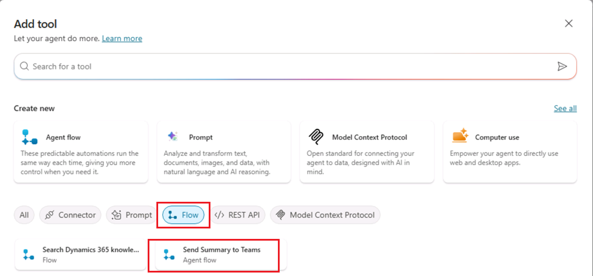

1. **`Send Summary to Teams`(Teams에 요약 보내기)** 워크플로를 선택합니다.

1. **추가 및 구성(Add and configure)**을 선택합니다.

1. **세부 정보(Details)** 섹션의 **설명(Description)**에 **`Sends a summary of the completed task analysis to a Microsoft Teams channel`(완료된 작업 분석의 요약을 Microsoft Teams 채널로 전송)**을 입력합니다.

1. **추가 세부 정보(Additional details)**를 펼친 후 다음 항목을 선택하고 입력합니다.

   - **이 도구를 사용할 수 있는 경우(When this tool may be used)**: 에이전트가 언제든지 이 도구를 사용할 수 있음(Agent may use this tool at any time)
   - **실행하기 전에 최종 사용자에게 질문합니다(Ask the end user before running)**: 아니요(No)
   - **사용할 자격 증명(Credentials to use)**: 최종 사용자 자격 증명(End user credentials)
   - **설명(Description)**: **`Please sign in to notify Teams`(Teams에 알리려면 로그인하세요)**

1. **입력(Inputs)** 섹션의 *다음을 사용하여 채우기(Fill using)*에서 **AI를 사용하여 동적으로 채우기(Dynamically fill with AI)**를 선택합니다.

   이렇게 하면 에이전트가 대화 컨텍스트에서 적절한 입력 값을 동적으로 결정할 수 있습니다.

1. **완료(Completion)** 섹션의 **실행 후(After running)**에서 **생성형 AI로 응답 작성(Write the response with generative AI)**을 선택합니다.

   

1. **저장(Save)**을 선택합니다.

### 작업 2.5 - 에이전트 지침 업데이트

> [!IMPORTANT]
> Copilot이 에이전트를 만들 때 생성하는 지침은 일정하지 않으며, 흔히 길고 일반적입니다. 이러한 지침 때문에 에이전트가 토픽과 도구를 호출하는 대신 지식에서 답변하거나 사용자에게 작업 목록을 요청할 수 있습니다. 이 작업에서는 생성된 지침을 구체적인 지침 세트로 바꾸어 남은 연습에서 에이전트가 예측 가능하게 동작하도록 합니다.

1. **개요(Overview)** 탭을 선택합니다.

1. **지침(Instructions)** 섹션에서 **편집(Edit)**을 선택합니다.

1. **지침(Instructions)** 상자의 기존 텍스트를 모두 선택하여 삭제합니다.

1. 다음 지침을 입력합니다. 텍스트에 `<Send Summary to Teams>`와 같은 자리 표시자가 있는 경우 자리 표시자를 입력하지 않습니다. 대신 `/`를 입력한 다음 목록에서 **`Send Summary to Teams`(Teams에 요약 보내기)** 도구를 선택하여 도구 참조로 삽입합니다.

  ```prompt
   # Purpose
   The purpose of this agent is to analyze, categorize, and prioritize tasks, and to send a summary of the analysis to a Microsoft Teams channel.

   # General guidelines
   - Maintain a professional and supportive tone.
   - Always use the topics and tools listed below. Don't answer from your own knowledge.

   # Skills
   - Use the <Send Summary to Teams> tool to post a summary of the task analysis to Microsoft Teams.

   # Step-by-step instructions
   1. Analyze tasks
      - Categorize and prioritize the tasks that the user provides.
   2. Send the results
      - Use the <Send Summary to Teams> tool when the task analysis is complete.
   ```

  ```prompt
   # 목적
   이 에이전트의 목적은 작업을 분석하고 분류하며 우선순위를 지정한 후 분석 요약을 Microsoft Teams 채널로 보내는 것입니다.

   # 일반 지침
   - 전문적이고 지원적인 어조를 유지합니다.
   - 항상 아래 나열된 토픽과 도구를 사용합니다. 자체 지식으로 답변하지 않습니다.

   # 기술
   - <Send Summary to Teams> 도구를 사용하여 작업 분석 요약을 Microsoft Teams에 게시합니다.

   # 단계별 지침
   1. 작업 분석
      - 사용자가 제공한 작업을 분류하고 우선순위를 지정합니다.
   2. 결과 보내기
      - 작업 분석이 완료되면 <Send Summary to Teams> 도구를 사용합니다.
   ```

   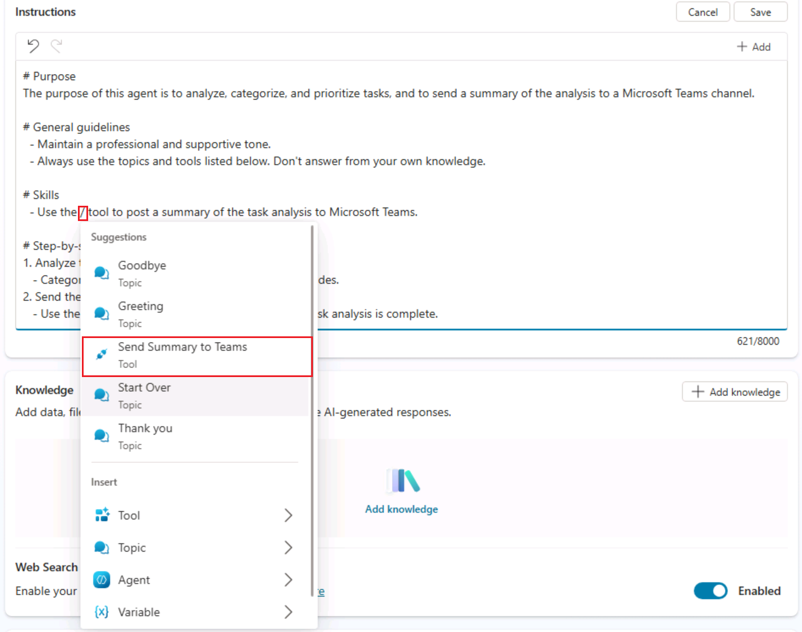

5. **저장(Save)**을 선택합니다.

### 작업 2.6 - 에이전트에서 워크플로 도구 테스트

1. 페이지 오른쪽 위에서 **테스트(Test)** 아이콘을 선택하여 테스트 창을 엽니다.

1. **테스트(Test)** 창에서 변수 **{x}** 아이콘 옆의 줄임표(**...**)를 선택하고 **테스트할 때 활동 맵 표시(Show activity map when testing)**를 **켜기(On)**로, **토픽 간 추적(Track between topics)**을 **끄기(Off)**로 전환합니다.

   

1. **테스트(Test)** 창 위쪽에서 **새 테스트 세션 시작(Start new test session)** 아이콘 **+**를 선택합니다.

1. **대화 시작(Conversation Start)** 메시지가 표시되면 에이전트가 대화를 시작합니다. 응답으로 다음 내용을 입력하여 만든 토픽을 트리거해 봅니다.

   ```prompt
   Analyze this list of tasks 1. Build an agent, 2. Test an agent, 3. Deploy an agent
   ```

   ```prompt
   다음 작업 목록을 분석하세요. 1. 에이전트 구축, 2. 에이전트 테스트, 3. 에이전트 배포.
   ```

1. Microsoft Teams에 연결하라는 메시지가 표시되면 **허용(Allow)**을 선택합니다.

   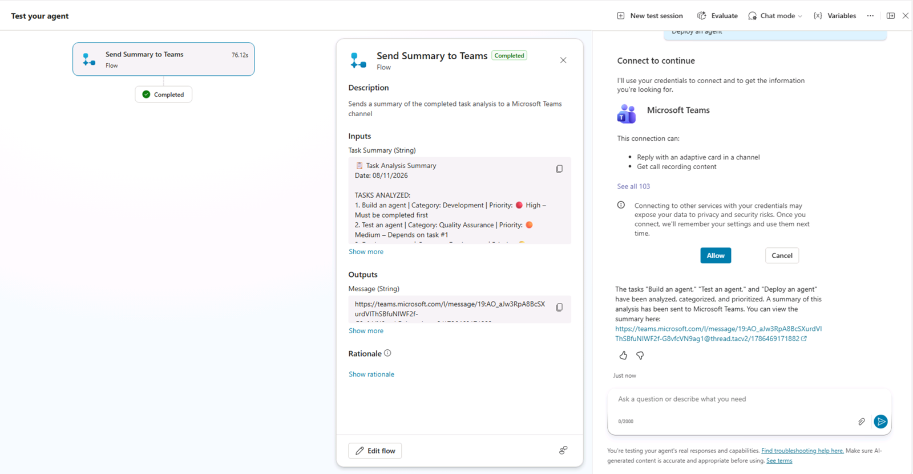

1. 새 브라우저 탭에서 `https://teams.cloud.microsoft/`로 이동하고 메시지가 표시되면 로그인합니다.

1. 앞에서 워크플로에 선택한 팀과 채널로 이동하여 작업 분석 요약이 Teams 채널에 게시되었는지 확인합니다.

   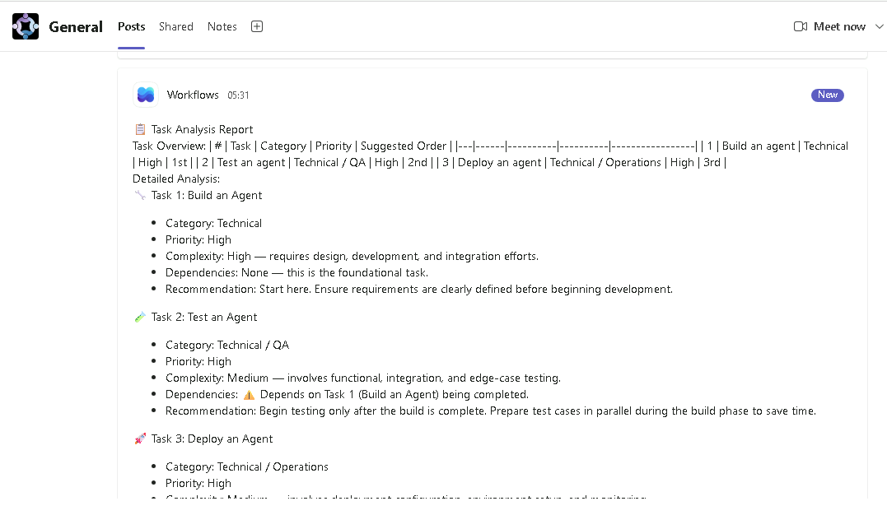

## 연습 3 - 토픽에서 Excel 파일을 분석하는 워크플로 도구 만들기

이 연습에서는 Copilot을 사용하여 설명에서 토픽을 만들고, Excel 파일의 작업을 분석하는 워크플로 도구를 만든 다음, 토픽에서 도구를 호출합니다.

### 작업 3.1 - Excel 파일 만들기

> [!NOTE]
> 이 스프레드시트를 만드는 데 문제가 있으면 [파일 다운로드](../../Allfiles/Operations%20tasks.xlsx) 링크에서 복사본을 다운로드할 수 있습니다.

1. Copilot Studio의 왼쪽 위에서 **앱 시작 관리자(App launcher)** 아이콘을 선택한 다음 **OneDrive**를 선택합니다.

   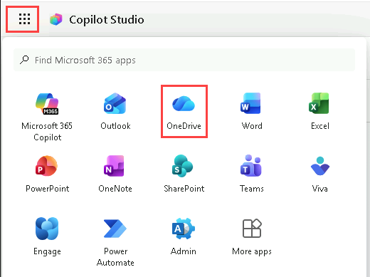

1. 메시지가 표시되면 시작 메시지를 건너뜁니다.

1. **+ 만들기 또는 업로드(+ Create or upload)**를 선택합니다.

1. **Excel 통합 문서(Excel workbook)**를 선택합니다.

   

1. **Excel 통합 문서(Excel workbook)**의 왼쪽 위에서 **Book**을 선택하고 **`Operations tasks`(운영 작업)**를 입력하여 파일 이름을 바꿉니다.

   

1. 첫 번째 행에 다음 열을 만듭니다.

   - `Reference`
   - `Title`
   - `Description`
   - `Requested by`
   - `Priority`
   - `Status`

1. 두 번째 행에 첫 번째 작업의 다음 값을 입력합니다.

   - `OPS-001`
   - `Server Patch Update`
   - `Apply monthly security patches to production servers`
   - `IT Operations`
   - `High`
   - `Open`

1. 세 번째 행에 두 번째 작업의 다음 값을 입력합니다.

   - `OPS-002`
   - `Backup Validation`
   - `Verify nightly backups completed successfully`
   - `Infrastructure Team`
   - `Medium`
   - `In Progress`

1. 네 번째 행에 세 번째 작업의 다음 값을 입력합니다.

   - `OPS-003`
   - `Access Review`
   - `Review and remove inactive user accounts`
   - `Security Team`
   - `High`
   - `Open`

1. 다섯 번째 행에 네 번째 작업의 다음 값을 입력합니다.

   - `OPS-004`
   - `Incident Report`
   - `Document root cause for recent service outage`
   - `Service Desk`
   - `Medium`
   - `Completed`

   

1. 데이터가 포함된 행과 열(A1:F5)을 선택하고 도구 모음에서 **삽입(Insert)** 탭을 선택한 다음 **표(Table)**를 선택합니다. **머리글 포함(My table has headers)** 확인란을 선택한 후 **확인(OK)**을 선택합니다.

1. **테이블 디자인(Table Design)** 탭을 선택하고 왼쪽 위에서 테이블 이름을 *Table1*에서 **`Tasks`**로 변경합니다.

   

1. Excel 통합 문서가 있는 브라우저 탭을 닫습니다.

1. OneDrive에서 **내 파일(My files)**을 선택하고 **`Operations tasks`(운영 작업)** Excel 통합 문서가 목록에 있는지 확인합니다.

1. OneDrive 브라우저 탭을 닫습니다.

### 작업 3.2 – Excel 작업 분석 워크플로 만들기

1. Copilot Studio의 왼쪽 탐색 영역에서 **도구(Tools)**를 선택합니다.

1. **+ 도구 추가(+ Add a tool)**를 선택합니다. 일부 환경에서는 이 옵션이 **+ 새 도구(+ New tool)**로 표시됩니다.

1. **도구 추가(Add tool)** 대화 상자에서 **에이전트 흐름(Agent flow)** 타일을 선택합니다.

1. **에이전트가 흐름을 호출할 때(When an agent calls the flow)** 트리거와 **에이전트에 응답(Respond to the agent)** 작업이 워크플로에 추가되었는지 확인합니다.

1. **에이전트가 흐름을 호출할 때(When an agent calls the flow)** 트리거 단계를 선택한 후 **+ 입력 추가(+ Add an input)**를 선택합니다.

1. **텍스트(Text)**를 선택합니다.

1. *입력(Input)*에 `Priority`(우선순위)를 입력하고 *입력을 입력하세요(Please enter your input)*에 **`Priority of Tasks`(작업 우선순위)**를 입력합니다.

1. 페이지 오른쪽 위 근처에서 **초안 저장(Save draft)**을 선택합니다.

1. **개요(Overview)** 탭을 선택합니다.

1. **세부 정보(Details)** 섹션에서 **편집(Edit)**을 선택합니다.

1. **세부 정보(Details)** 창에서 **흐름 이름(Flow name)**을 **`Get Task List`(작업 목록 가져오기)**로 업데이트합니다.

1. **설명(Description)**에 **`Retrieve a list of tasks with a matching priority`(우선순위가 일치하는 작업 목록 검색)**을 입력합니다.

1. **저장(Save)**을 선택합니다.

1. **디자이너(Designer)** 탭을 선택합니다.

1. 워크플로의 두 단계 사이에서 **+** 아이콘을 선택하여 새 작업을 삽입합니다.

1. **검색(Search)** 필드에 `Excel`을 입력하고 **Excel Online (Business)** 커넥터에서 **자세히 보기(See more)**를 선택합니다.

1. **테이블에 있는 행 나열(List rows present in a table)** 작업을 선택합니다.

1. **로그인(Sign in)**을 선택하여 연결을 만듭니다.

1. **계정에 로그인(Sign into your account)** 대화 상자에서 이 랩 환경에 사용하는 계정(예: **MOD Administrator**)을 선택합니다. 메시지가 표시되면 **이 요청을 확인했으며 원본을 신뢰합니다(I have verified this request and trust the source)** 확인란을 선택하고 **액세스 허용(Allow access)**을 선택합니다.

1. **위치(Location)**에서 **OneDrive for Business**를 선택합니다.

1. **문서 라이브러리(Document library)**에서 **OneDrive**를 선택합니다.

1. **파일(File)**에서 찾아보기를 사용하여 **`Operations tasks`(운영 작업)** 통합 문서를 선택합니다.

1. **테이블(Table)**에서 **Tasks**를 선택합니다.

   

1. **모두 보기(Show all)**를 선택합니다.

1. **필터 쿼리(Filter query)**에 `Priority eq ''`를 입력합니다.

1. 두 개의 작은따옴표 사이에 커서를 놓고 **동적 콘텐츠(Dynamic content)**를 사용하여 **Priority** 입력 매개 변수를 삽입합니다.

   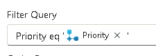

1. 제작 캔버스에서 **에이전트에 응답(Respond to the agent)** 노드를 선택한 후 **+ 출력 추가(+ Add an output)**를 선택합니다.

1. **텍스트(Text)**를 선택합니다.

1. *이름 입력(Enter a name)*에 **`Task list`(작업 목록)**를 입력합니다.

1. *응답할 값 입력(Enter a value to respond with)*에서 필드를 선택한 다음 **식(Expression)**(**fx**) 옵션을 선택합니다. 반환된 행을 **텍스트(Text)** 출력 형식과 일치하는 텍스트로 변환하려면 다음 식을 입력한 후 **추가(Add)**를 선택합니다.

   ```prompt
   string(outputs('List_rows_present_in_a_table')?['body/value'])
   ```
   
   ```prompt
   string(outputs('테이블에_있는_행_나열')?['body/value'])
   ```
   

1. 페이지 오른쪽 위 근처에서 **초안 저장(Save draft)**을 선택합니다.

1. 페이지 오른쪽 위 근처에서 **게시(Publish)**를 선택합니다.

1. 왼쪽 탐색 영역에서 **도구(Tools)**를 선택하여 워크플로 상태가 **준비됨(Ready)**인지 확인합니다.

### 작업 3.3 – 에이전트에 토픽 추가

1. 왼쪽 탐색 창에서 **에이전트(Agents)**를 선택합니다.

1. **`Task Analysis`(작업 분석)** 에이전트를 엽니다.

1. **토픽(Topics)** 탭을 선택합니다.

1. **+ 토픽 추가(+ Add a topic)**를 선택하고 **Copilot을 사용하여 설명에서 추가(Add from description with Copilot)**를 선택합니다. 새 대화 상자 창이 표시됩니다.

1. **토픽 이름 지정(Name your topic)** 텍스트 상자에 **`Priority Tasks`(우선순위 작업)**를 입력합니다.

1. **다음을 수행하는 토픽 만들기(Create a topic to...)** 텍스트 상자에 다음 영문 또는 한국어 프롬프트 중 하나를 입력합니다.

   ```prompt
   Ask the user to choose a priority from a list containing High, Medium, and Low
   ```

   ```prompt
   높음, 보통, 낮음 이 포함된 목록에서 우선순위를 선택하도록 사용자에게 요청합니다.
   ```

1. **만들기(Create)**를 선택합니다.

   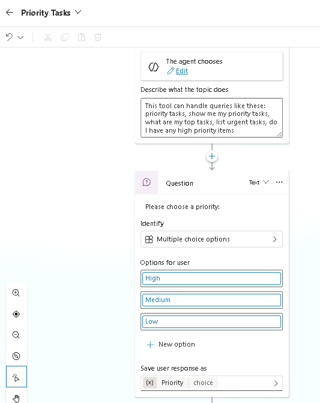

1. 질문 노드 아래쪽에서 **Priority** 변수를 선택하여 **변수 속성(Variables properties)**을 엽니다.

1. **사용량(Usage)**에서 **전역(모든 토픽에서 액세스 가능)(Global (any topic can access))**을 선택합니다.

   

1. **저장(Save)**을 선택합니다.

### 작업 3.4 - 워크플로를 도구로 추가

1. 왼쪽 탐색 창에서 **에이전트(Agents)**를 선택합니다.

1. **`Task Analysis`(작업 분석)** 에이전트를 엽니다.

1. **도구(Tools)** 탭을 선택합니다.

1. **+ 도구 추가(+ Add a tool)**를 선택합니다.

1. **도구 추가(Add tool)** 대화 상자에서 **워크플로(Flow)** 필터를 선택합니다.

1. **`Get Task List`(작업 목록 가져오기)** 워크플로를 선택합니다.

1. **추가 및 구성(Add and configure)**을 선택합니다.

1. **세부 정보(Details)** 섹션의 **설명(Description)**을 입력합니다.

```prompt
Retrieves a list of tasks for a specified priority
```

```prompt
지정한 우선순위의 작업 목록 검색
```

1. **추가 세부 정보(Additional details)**를 펼친 후 다음 항목을 선택하거나 입력합니다.

   - **이 도구를 사용할 수 있는 경우(When this tool may be used)**: 토픽 또는 에이전트에서 참조하는 경우에만(Only when referenced by topics or agents)
   - **실행하기 전에 최종 사용자에게 질문합니다(Ask the end user before running)**: 아니요(No)
   - **사용할 자격 증명(Credentials to use)**: 최종 사용자 자격 증명(End user credentials)
   - **설명(Description)**: *`Please sign in to retrieve tasks`(작업을 검색하려면 로그인하세요)*

1. **입력(Inputs)** 섹션의 **다음을 사용하여 채우기(Fill using)**에서 **사용자 지정 값(Custom value)**을 선택한 다음 **Priority** 전역 변수를 선택합니다.

   

1. **Global.Priority** 값 옆의 줄임표(**...**)를 선택하고 **수식(Formula)**(**fx**)을 선택한 다음 `Text(Global.Priority)`를 입력하고 **삽입(Insert)**을 선택합니다. **Priority** 질문은 선택 값을 저장하지만 워크플로에는 텍스트가 필요하므로, 이 수식은 값을 변환하여 형식 불일치 오류를 방지합니다.

1. **완료(Completion)** 섹션의 **실행 후(After running)**에서 **생성형 AI로 응답 작성(Write the response with generative AI)**을 선택합니다.

1. **저장(Save)**을 선택합니다.

### 작업 3.5 - 워크플로 도구를 토픽에 추가

1. **토픽(Topics)** 탭을 선택합니다.

1. **`Priority Tasks`(우선순위 작업)** 토픽을 선택합니다.

1. **질문(Question)** 노드 아래에서 **+** 아이콘을 선택하고 **도구 추가(Add a tool)**를 선택한 후 **도구(Tool)** 탭을 선택한 다음 **`Get Task List`(작업 목록 가져오기)** 도구를 선택합니다.

   

1. **저장(Save)**을 선택합니다.

### 작업 3.6 - 토픽을 사용하도록 에이전트 지침 업데이트

1. **개요(Overview)** 탭을 선택합니다.

1. **지침(Instructions)** 섹션에서 **편집(Edit)**을 선택합니다.

1. *# Skills*(기술) 섹션에 새 줄을 추가하고 `- Use the `를 입력한 다음 `/`를 입력하고 **`Priority Tasks`(우선순위 작업)** 토픽을 선택한 후 `topic to get the task list.`를 입력합니다. 완성되는 지침은 다음과 같습니다. 한국어 지침을 사용하는 경우에도 `<우선순위 작업>` 자리 표시자는 입력하지 않고 `/`를 사용하여 토픽 참조를 삽입합니다.

   ```prompt
   - Use the <Priority Tasks> topic to get the task list.
   ```

   ```prompt
   - <우선순위 작업> 토픽을 사용하여 작업 목록을 가져옵니다.
   ```

1. *# Step-by-step instructions*(단계별 지침) 섹션의 **1. Analyze tasks**(작업 분석) 아래에 새 줄을 추가하고 `- Use the `를 입력한 다음 `/`를 입력하고 **`Priority Tasks`(우선순위 작업)** 토픽을 선택한 후 `topic to get the task list.`를 입력합니다. 완성되는 지침은 다음과 같습니다. 한국어 지침을 사용하는 경우에도 `<우선순위 작업>` 자리 표시자는 입력하지 않고 `/`를 사용하여 토픽 참조를 삽입합니다.

   ```prompt
   - Use the <Priority Tasks> topic to get the task list.
   ```

   ```prompt
   - <우선순위 작업> 토픽을 사용하여 작업 목록을 가져옵니다.
   ```

1. **저장(Save)**을 선택합니다.

### 작업 3.7 - 워크플로 도구 테스트

1. 페이지 오른쪽 위에서 **테스트(Test)** 아이콘을 선택하여 테스트 창을 엽니다.

1. **테스트(Test)** 창에서 변수 **{x}** 아이콘 옆의 줄임표(**...**)를 선택하고 **테스트할 때 활동 맵 표시(Show activity map when testing)**를 **끄기(Off)**로, **토픽 간 추적(Track between topics)**을 **켜기(On)**로 전환합니다.

1. **테스트(Test)** 창 위쪽에서 **새 테스트 세션 시작(Start new test session)** 아이콘 **+**를 선택합니다.

1. **대화 시작(Conversation Start)** 메시지가 표시되면 에이전트가 대화를 시작합니다. 다음 영문 또는 한국어 프롬프트 중 하나를 입력하여 만든 토픽을 트리거합니다.

   ```prompt
   Analyze the task list
   ```

   ```prompt
   작업 목록을 분석하세요.
   ```

1. **`Priority Tasks`(우선순위 작업)** 토픽이 표시됩니다.

   > [!NOTE]
   > 에이전트가 **`Priority Tasks`(우선순위 작업)** 토픽을 열지 않고 답변하는 경우 **개요(Overview)** 탭에서 에이전트 지침에 **`Priority Tasks`(우선순위 작업)** 토픽과 **`Send Summary to Teams`(Teams에 요약 보내기)** 도구가 삽입된 참조로 포함되어 있는지 확인한 다음 새 테스트 세션을 시작합니다.

1. **Medium**(보통)을 선택합니다.

1. **Excel Online (Business)**에 연결하라는 메시지가 표시되면 **허용(Allow)**을 선택합니다.

1. **테스트(Test)** 창에 두 개의 작업이 표시되어야 합니다.

   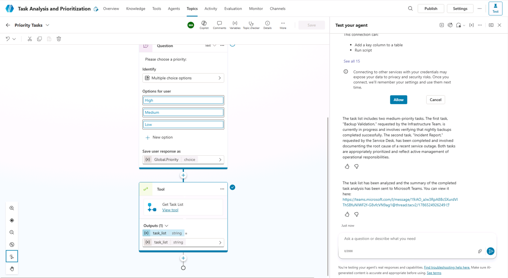

1. 새 브라우저 탭에서 `https://teams.cloud.microsoft/`로 이동하고 메시지가 표시되면 로그인합니다.

1. 앞에서 선택한 팀과 채널로 이동하여 채널에 게시된 두 작업을 검토합니다.

   

## 요약

이 랩에서는 생성형 AI를 사용하여 에이전트가 호출하는 워크플로 도구와 토픽에서 호출하는 워크플로 도구를 만들었습니다.
